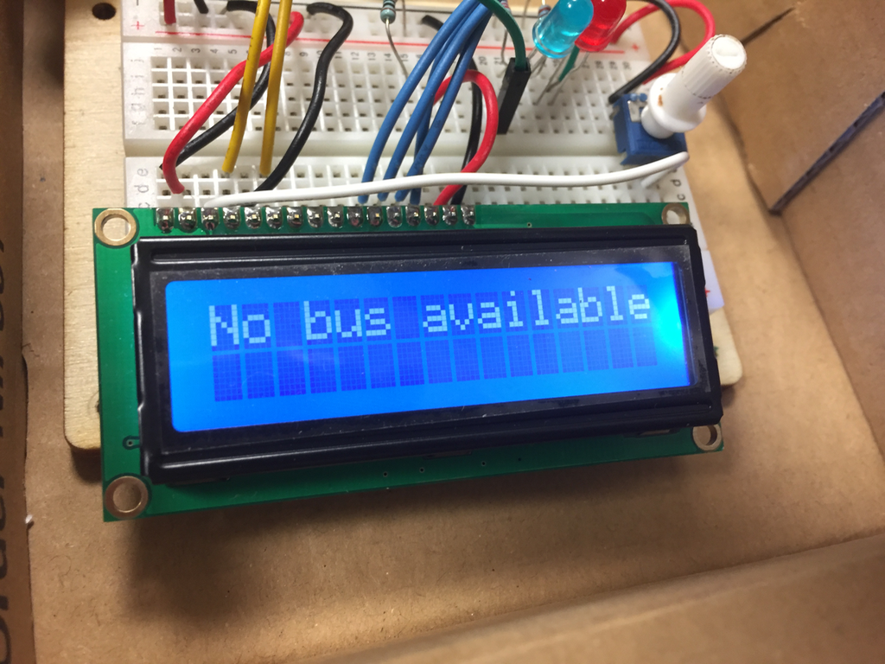
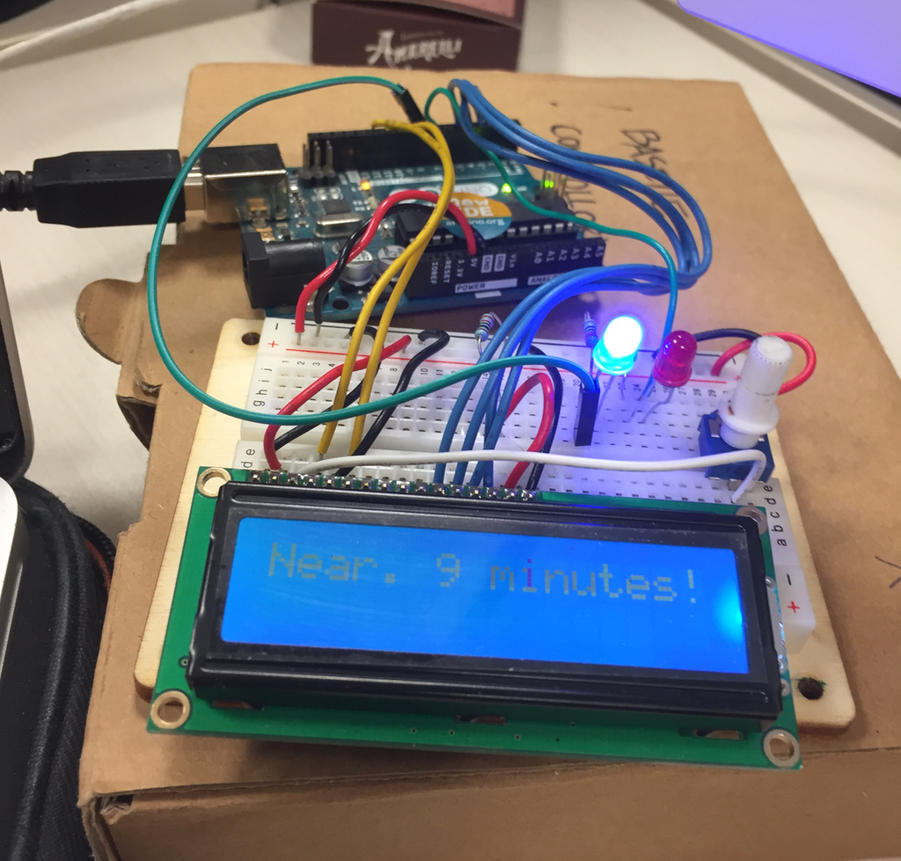

# ARDUINO BUS ALERT
This small project queries the *Muoversi A Roma API* open data in order get the current estimated time for the arrival of the bus.

It then uses the serial port to send the information to the arduino uno which triggers a small LCD display and two leds so that I can get out of my office just at the right time!

